# APK 逆向攻击网

线性分析链不够。攻击网 = 多入口、多分叉、跨分类交织的图结构。每个节点是一个 Primitive，每条边是一个分析步骤或工具操作。

## 全网图 (Mermaid)

```mermaid
graph TD
    %% === Layer 0: Entry Points ===
    APK["APK File<br/>安装包/样本"]
    URL["Download URL<br/>应用市场/CDN"]
    BUNDLE["AAB Bundle<br/>Google Play"]

    %% === Layer 1: Manifest & Entry ===
    MANIFEST["AndroidManifest<br/>03-manifest"]
    COMPONENT["Component Map<br/>Activity/Service/Receiver"]
    PERMISSION["Permission Map<br/>03-manifest"]
    ENTRY_TRACE["Entry Point Chain<br/>03-manifest"]
    DEX_LOADER["DEX ClassLoader<br/>07-packer"]

    %% === Layer 2: Static Analysis ===
    JADX["jadx<br/>01-dex-java"]
    APKTOOL["apktool<br/>01-dex-java"]
    SMALI["smali<br/>01-dex-java"]
    NATIVE["Native/SO<br/>02-native"]
    IL2CPP["IL2CPP<br/>02-native"]
    UE4["UE4<br/>02-native"]
    STRINGS_SO["SO Strings<br/>02-native"]
    IMPORT_SO["SO Imports<br/>02-native"]

    %% === Layer 3: Crypto Detection ===
    CRYPTO_APK["Crypto Discovery<br/>04-crypto"]
    ENC_PATTERN["Encrypt Pattern<br/>04-crypto"]
    RC4_CUSTOM["RC4/Custom<br/>04-crypto"]
    KEY_STORE["KeyStore/Cert<br/>04-crypto"]

    %% === Layer 4: Network ===
    NETWORK["Network Hook<br/>05-network"]
    PROTOCOL_GAME["Game Protocol<br/>05-network"]
    LICENSE_VERIFY["License Verify<br/>05-network"]
    OKHTTP["OkHttp Hook<br/>05-network"]
    CERTPIN["Cert Pinning<br/>05-network"]

    %% === Layer 5: Dynamic Instrumentation ===
    FRIDA_APK["Frida<br/>06-dynamic"]
    MEM_RW["Memory R/W<br/>06-dynamic"]
    OVERLAY_RENDER["Overlay Render<br/>06-dynamic"]
    TOUCH_INPUT["Touch Input<br/>06-dynamic"]
    FRIDA_SPAWN["Frida Spawn<br/>06-dynamic"]
    FRIDA_ATTACH["Frida Attach<br/>06-dynamic"]

    %% === Layer 6: Obfuscation / Packer ===
    PACKER_APK["Packer Detection<br/>07-packer"]
    OBFUSCATE["Obfuscation ID<br/>07-packer"]
    SELF_EXTRACT["Self Extract<br/>07-packer"]
    DEX_UNPACK["DEX Unpack<br/>07-packer"]
    SO_UNPACK["SO Unpack<br/>07-packer"]

    %% === Layer 7: Patch / Repack ===
    REPACK["Repack<br/>08-patch-repack"]
    SMALI_INJECT["Smali Inject<br/>08-patch-repack"]
    SO_INJECT["SO Inject<br/>08-patch-repack"]
    APK_SIGN["APK Sign<br/>08-patch-repack"]
    INTEGRITY["Integrity Bypass<br/>08-patch-repack"]

    %% === Layer 8: Output ===
    REPORT_APK["分析报告<br/>reports/android/"]
    PATCHED_APK["Patched APK<br/>patches/android/"]
    FRIDA_SCRIPT["Frida Script<br/>scripts/android/"]
    DECRYPT_DATA["Decrypted Data<br/>exports/android/"]

    %% --- Edges: Entry → Manifest ---
    APK -->|apktool d| APKTOOL
    APK -->|jadx-gui| JADX
    APK -->|aapt dump| MANIFEST
    APK -->|package_info| PERMISSION
    URL -->|wget → APK| APK
    BUNDLE -->|bundletool → APK| APK

    %% --- Edges: Manifest → Static ---
    MANIFEST -->|exported components| COMPONENT
    MANIFEST -->|dangerous perms| PERMISSION
    COMPONENT -->|attachBaseContext| ENTRY_TRACE
    COMPONENT -->|startup Activity| DEX_LOADER

    %% --- Edges: Static → Static (internal) ---
    JADX -->|class analysis| SMALI
    JADX -->|System.loadLibrary| NATIVE
    JADX -->|libil2cpp.so| IL2CPP
    JADX -->|libUE4.so| UE4
    JADX -->|javax.crypto.*| CRYPTO_APK
    JADX -->|OkHttp/Retrofit| NETWORK
    APKTOOL -->|smali code| SMALI
    APKTOOL -->|lib/arm64/*.so| NATIVE
    SMALI -->|ClassLoader| DEX_LOADER
    NATIVE -->|readelf| IMPORT_SO
    NATIVE -->|strings| STRINGS_SO

    %% --- Edges: Static → Crypto ---
    CRYPTO_APK -->|Cipher.getInstance| ENC_PATTERN
    CRYPTO_APK -->|MessageDigest| ENC_PATTERN
    CRYPTO_APK -->|SecretKeySpec| KEY_STORE
    ENC_PATTERN -->|ECB/CBC mode| RC4_CUSTOM
    KEY_STORE -->|Android Keystore| CERTPIN

    %% --- Edges: Static → Network ---
    NETWORK -->|OkHttp Interceptor| OKHTTP
    NETWORK -->|Retrofit Interface| PROTOCOL_GAME
    NETWORK -->|SSLSocketFactory| CERTPIN
    NETWORK -->|license/verify API| LICENSE_VERIFY
    PROTOCOL_GAME -->|protobuf field| PROTO_REV

    %% --- Edges: Static → Dynamic ---
    NATIVE -->|hook target| FRIDA_APK
    CRYPTO_APK -->|encrypt/decrypt hook| FRIDA_APK
    NETWORK -->|send/recv hook| FRIDA_APK
    DEX_LOADER -->|ClassLoader hook| FRIDA_APK

    %% --- Edges: Dynamic → Dynamic (internal) ---
    FRIDA_APK -->|android_frida_run_script| FRIDA_SPAWN
    FRIDA_APK -->|android_frida_run_script| FRIDA_ATTACH
    FRIDA_SPAWN -->|Process.findModuleByName| MEM_RW
    FRIDA_ATTACH -->|Java.perform| MEM_RW
    FRIDA_APK -->|ANativeWindow| OVERLAY_RENDER
    FRIDA_APK -->|dispatchTouchEvent| TOUCH_INPUT

    %% --- Edges: Dynamic → Crypto/Network ---
    FRIDA_APK -->|Cipher.doFinal hook| ENC_PATTERN
    FRIDA_APK -->|OkHttp.addInterceptor| OKHTTP
    FRIDA_APK -->|Socket.send| PROTOCOL_GAME
    MEM_RW -->|/proc/pid/mem| DECRYPT_DATA

    %% --- Edges: Dynamic → Packer/Unpack ---
    FRIDA_APK -->|DexClassLoader hook| DEX_UNPACK
    FRIDA_APK -->|dlopen hook| SO_UNPACK
    FRIDA_SPAWN -->|early hook| DEX_UNPACK

    %% --- Edges: Static → Packer ---
    DEX_LOADER -->|multidex| PACKER_APK
    SMALI -->|oxorany/ollvm| OBFUSCATE
    NATIVE -->|UPX/自定义| SELF_EXTRACT

    %% --- Edges: Packer → Unpack → Analysis ---
    PACKER_APK -->|加固识别| DEX_UNPACK
    OBFUSCATE -->|混淆策略| SO_UNPACK
    DEX_UNPACK -->|dump dex| JADX
    SO_UNPACK -->|dump so| NATIVE
    SELF_EXTRACT -->|extract payload| DEX_UNPACK

    %% --- Edges: Analysis → Patch/Repack ---
    SMALI -->|modify logic| SMALI_INJECT
    NATIVE -->|inject .so| SO_INJECT
    CRYPTO_APK -->|patch bypass| SMALI_INJECT
    LICENSE_VERIFY -->|always true| SMALI_INJECT
    CERTPIN -->|remove pinning| SMALI_INJECT

    %% --- Edges: Patch → Repack → Output ---
    SMALI_INJECT -->|apktool b| REPACK
    SO_INJECT -->|copy to lib/| REPACK
    REPACK -->|uber-apk-signer| APK_SIGN
    APK_SIGN -->|adb install| PATCHED_APK
    INTEGRITY -->|hook bypass| SMALI_INJECT

    %% --- Edges: Everything → Output ---
    JADX -->|decompiled src| DECRYPT_DATA
    FRIDA_APK -->|hook output| DECRYPT_DATA
    DEX_UNPACK -->|unpacked dex| DECRYPT_DATA
    PROTOCOL_GAME -->|packet format| REPORT_APK
    ENC_PATTERN -->|algorithm notes| REPORT_APK
    MEM_RW -->|memory dump| DECRYPT_DATA
    DECRYPT_DATA -->|evidence| REPORT_APK
    FRIDA_APK -->|android_frida_template_library| FRIDA_SCRIPT

    %% --- Cross-category edges ---
    RC4_CUSTOM -.->|key recovery| DECRYPT_DATA
    OBFUSCATE -.->|deobfuscate| SO_UNPACK
    OKHTTP -.->|request modify| LICENSE_VERIFY
    PERMISSION -.->|permission abuse| TOUCH_INPUT
    OVERLAY_RENDER -.->|ImGui overlay| FRIDA_APK
    SO_INJECT -.->|native hook| MEM_RW
    APK_SIGN -.->|signature check bypass| INTEGRITY
```



## 典型攻击网路径

### 路径 1: 标准 APK 逆向 (Entry→Static→Crypto→Dynamic→Report)
```
APK → jadx → Java class analysis
  ├─ → javax.crypto → Cipher.doFinal target → Frida hook → decrypt data → Report
  ├─ → OkHttp → request/response hook → Frida → packet format → Report
  └─ → System.loadLibrary → libtarget.so → Ghidra → SO analysis → Frida Native hook
```

### 路径 2: 游戏外挂 (APK→Native→Dynamic→Patch→Repack)
```
APK → jadx → libil2cpp.so/libUE4.so → IL2CPP/UE4 offset discovery
  → Frida attach → memory R/W → pointer chain → external memory hack
    ├─ → ESP/Wallhack (Overlay render + D3D/OpenGL ES hook)
    ├─ → Speedhack (time function hook)
    └─ → SO injection → repack → APK sign → adb install → test
```

### 路径 3: 脱壳 (APK→Packer→Frida→Dump→Re-Analyze)
```
APK → jadx → multidex/DexClassLoader → packer detected (加固)
  → Frida spawn → early ClassLoader hook → dump all dex files
  → readelf on libprotect.so → UPX/ollvm detected
  → Frida hook dlopen → dump decrypted SO at runtime
  → jadx + Ghidra re-analyze dumped files
```

### 路径 4: 在线验证绕过 (APK→Network→License→Patch→Repack)
```
APK → jadx → OkHttp/Retrofit → license/verify endpoint
  → Frida hook → intercept verify response → always return true
  → smali modify → patch verify logic → apktool b → sign → install
    ├─ → bypass: smali always return true
    ├─ → bypass: hook HTTP response to inject {"valid": true}
    └─ → bypass: SSL pinning remove → Burp/Charles proxy → inspect
```

### 路径 5: 协议逆向 (APK→Network→Protocol→Frida→Script)
```
APK → jadx → Retrofit interface methods → protobuf field names
  → Frida hook Protobuf.SerializeToByteArray → capture raw bytes
  → Frida hook Socket.send/recv → capture all packets
  → analyze field structure → protobuf-decoder → game protocol doc
```

### 路径 6: SO 注入 + 功能修改 (APK→Native→Inject→Repack→Test)
```
APK → apktool d → lib/arm64-v8a/libtarget.so → analyze
  → write inject.so (hook key functions via Frida Gadget/Substrate)
  → inject into lib/ + smali System.loadLibrary("inject")
  → modify AndroidManifest if needed (permissions)
  → apktool b → uber-apk-signer → adb install → Frida verify
```

## 关键枢纽节点

| 节点 | 入度 | 出度 | 说明 |
|------|------|------|------|
| `Frida` | 10 | 5 | 动态分析核心，连接静态发现→动态验证→数据dump |
| `jadx` | 2 | 5 | Java层静态分析入口，发现加密/网络/Native入口 |
| `Native/SO` | 4 | 4 | SO分析的必经之路 |
| `Smali` | 4 | 3 | Java层patch的中转站 |
| `Crypto Discovery` | 2 | 3 | 加密算法识别 → hook → dump |
| `Repack` | 2 | 1 | patch最终输出前的组装节点 |

## 隐性连接

```
APK → Play Store scraping → version history → diff → find regression bugs
  (通过应用历史版本对比，发现旧版本漏洞重利用)

jadx → embedded assets → HTML/JS → WebView XSS → token steal
  (APK 内嵌 WebView 可能暴露 XSS 攻击面)

Frida → hook libc fopen → log all file I/O → find config/key files
  (通过文件 IO hook 发现隐藏的配置文件/密钥文件)

SMALI_INJECT → dynamic load native lib → bypass integrity check
  (注入的 smali 动态加载自定义 SO，绕过签名校验)

AndroidManifest → exported provider → data leak → CVE
  (导出的 ContentProvider 无权限保护 → 敏感数据泄露)
```

## 攻击网驱动决策

```
拿到 APK 后:
1. jadx 打开 → 读 AndroidManifest → 看 exported components / permissions
2. 查攻击网 → 从哪个 Entry 进入?
3. 有 crypto? → Crypto 路径 → Frida hook → dump
4. 有 OkHttp/Retrofit? → Network 路径 → protocol reverse
5. 有 libil2cpp/libUE4? → Native 路径 → offset discovery
6. 有多 dex / ClassLoader / 加固? → Packer 路径 → switch to Frida spawn
7. 目标是 patch? → 从 Smali 入口 → Inject → Repack → Sign
8. 目标只是分析? → 从任意分叉进入 → Decrypted Data → Report

不要线性思考 "APK→jadx→report"
而要网状思考 "APK → jadx → crypto → Frida → dump → re-analyze → patch → repack"
```

## 节点执行口径

每个节点都按同一格式推进：

```text
入口信号: Manifest、类名、方法签名、SO 名称、字符串、import 或运行时日志
打点动作: jadx/apktool/readelf/Ghidra/Frida/adb 中的具体命令或脚本
成功标志: hook 命中、明文出现、dex/so dump、patch 生效、repack 可安装运行
下一跳: Java / Native / Crypto / Network / Packer / Patch / Report 中的哪个节点
Evidence: 包名、组件、偏移、hook 输出、dump 路径、patch diff、运行截图或日志
```

如果某条路径只拿到类名或字符串，先把它转成可执行打点：Frida hook、Ghidra xref、OkHttp interceptor、`dlopen`/`RegisterNatives` 追踪或 smali patch。每轮输出都要能被下一轮直接消费。
