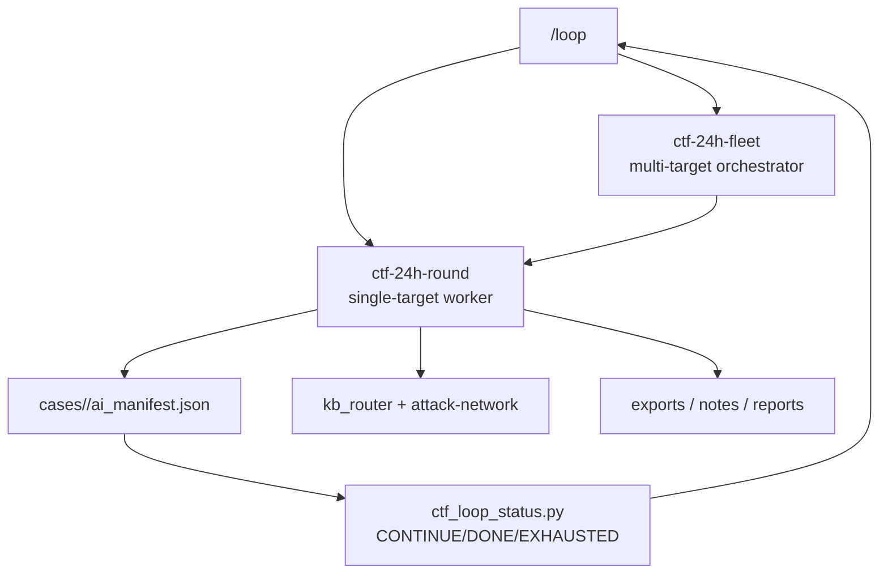

# 24h Loop Orchestration

面向 Claude Code / Codex 的 24 小时无人值守 Web CTF 工作流编排。目标是让
workflow 循环、checkpoint 和 KB 攻击路径形成闭环，而不是靠单次提示词长跑。

## 1. 架构



## 2. 单目标 Round

每轮执行：

1. 读取 `ai_manifest.json`。
2. 跑 `ctf_autopilot.py` 一轮，执行 allowlist 动作。
3. 对 `agent_required` 动作按攻击网选择 1-2 条路径深入。
4. 每发现信号，立即：
   ```bash
   python3 scripts/ctf-website/kb_router.py "<signal>"
   ```
5. 写回：
   - `autopilot.rounds[]`
   - `next_round_focus[]`
   - `attack_paths[]`
   - `evidence[]`
   - `dead_ends[]`
6. 运行：
   ```bash
   python3 scripts/ctf-website/ctf_loop_status.py cases/<case>/ai_manifest.json --write
   ```

## 3. 多目标 Fleet

多个网站不要共用一个 manifest。fleet 只负责调度：

| 层级 | 产物 |
|---|---|
| Fleet | `reports/ctf-website/<fleet>/fleet-round-*.md` |
| Target A | `cases/<fleet>-<target-a>/ai_manifest.json` |
| Target B | `cases/<fleet>-<target-b>/ai_manifest.json` |

调度策略：

1. 每轮按 `batchSize` 并行调用多个 `ctf-24h-round`。
2. 每个 target 独立输出 `STATUS`。
3. fleet 状态：
   - 全部 DONE -> `DONE`
   - 全部 EXHAUSTED -> `EXHAUSTED`
   - 其余 -> `CONTINUE`

## 4. 每轮攻击路径选择

优先级排序：

1. 已确认可达 target + 已有参数/表单/API。
2. 有 KB 精确匹配的信号：JWT、SQLi、SSRF、LFI、SSTI、CVE、IDOR、API key。
3. 能通向枢纽节点的路径：Credential Leak / Source Leak / DB / Admin / Backend RCE。
4. 上轮未验证、且未进入 `dead_ends[]` 的路径。
5. 低成本 recon：路由、JS endpoint、fingerprint、CVE graph。

每轮最多深入 2 条路径，避免无限发散。

## 5. 状态语义

| 状态 | 含义 |
|---|---|
| `CONTINUE` | 仍有 `next_round_focus` / `next_actions` / pending hypotheses |
| `DONE` | `evidence[]` 中记录 flag/solve 证据 |
| `EXHAUSTED` | 预算耗尽、max_rounds 耗尽或全部路径证据化失败 |

## 6. MCP 工具映射

| 步骤 | MCP / 脚本 |
|---|---|
| 初始化 case | `ctf_intake.py` / `ctf_new_challenge` |
| 单轮 checkpoint | `ctf_autopilot.py` / `ctf_autopilot_round` |
| 状态判定 | `ctf_loop_status.py` |
| KB 路由 | `kb_router` |
| HTTP baseline | `http_probe` |
| SQLi request replay | `ctf_save_request` + `run_sqlmap_request` |
| CVE graph/chain | `fingerprint_cve_pipeline.py` |
