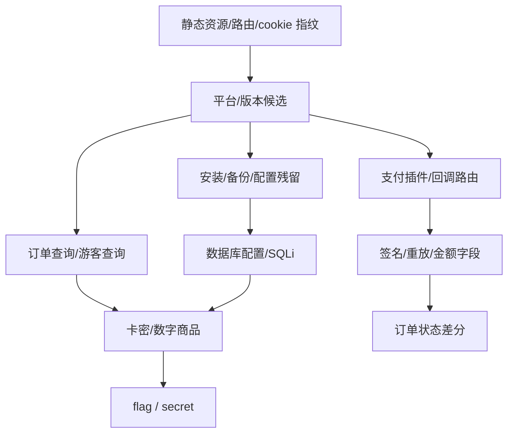

# PHP 发卡/电商平台指纹库

> 从实战案例中积累的平台识别指纹。用于快速判断目标CMS，定向查找已知漏洞。

## 0. 指纹到支付链路路线图

平台指纹不是终点。识别平台后，立刻判断订单查询、卡密发货、余额支付、支付插件、回调日志和安装残留这几条链。

| 指纹信号 | 优先接口 | 关键参数 | 下一跳 |
|---|---|---|---|
| `ready.js`, `window._data_var` | 商品/估价/下单 API | `commodity_id`, `pay_id`, `contact` | 金额/订单逻辑 |
| `/ajax.php?act=query` | 游客订单查询 | `qq`, `email`, `order_id` | IDOR/卡密 |
| `plugin/epay` | Epay 回调/跳转 | `out_trade_no`, `money`, `sign` | 签名/回调 |
| `/install/` | 安装残留 | lock file、数据库配置 | 配置/备份 |
| Laravel/dujiaoka | `/api/*`, `.env`, queue | `order_sn`, `payway`, `coupon` | 队列/回调 |
| 静态版本号 | `?v=...`, hash | 版本-漏洞映射 | 专项脚本 |



### 0.1 指纹采集脚本

```python
# payment_platform_fingerprint.py — 平台指纹与下一跳建议
import hashlib
import json
import re
import requests

PATHS = [
    "/", "/assets/common/js/ready.js", "/assets/common/js/_.js",
    "/user/api/index/query", "/ajax.php?act=query", "/install/",
    "/plugin/epay/", "/admin/",
]

RULES = [
    ("acg-faka", ["ready.js", "window._data_var", "/user/api/index/query"]),
    ("annie-mall", ["v1030", "/ajax.php?act=query"]),
    ("dujiaoka", ["laravel", "dujiaoka", "/api/orders"]),
    ("xycms", ["Xiangyun", "SeaCMS"]),
    ("emlog", ["emlog", "Layui"]),
]

def fp(base):
    hits = []
    for path in PATHS:
        url = base.rstrip("/") + path
        try:
            r = requests.get(url, timeout=6)
        except requests.RequestException as e:
            hits.append({"path": path, "error": str(e)})
            continue
        text = r.text[:5000]
        body_hash = hashlib.sha1(r.content[:4096]).hexdigest()
        matched = [name for name, keys in RULES if any(k.lower() in text.lower() or k in path for k in keys)]
        hits.append({"path": path, "status": r.status_code, "hash": body_hash, "matched": matched})
    print(json.dumps(hits, ensure_ascii=False, indent=2))
```

### 0.2 指纹置信度与链路路由

平台识别要落到可执行链路：订单查询、估价接口、支付插件、卡密发货、安装残留、数据库备份。只命中首页 banner 没价值，至少要拿到两个独立指纹和一个业务接口响应。

| 命中组合 | 平台置信度 | 立即打点 | 账本/SQL 下一跳 |
|---|---:|---|---|
| 静态资源 + API 前缀 | 中 | 抽商品、估价、下单参数 | `goods/orders/cards` 表名猜测 |
| API 前缀 + 订单查询 | 高 | 匿名/跨账号查订单 | IDOR、退信、卡密 |
| 支付插件路径 + 回调参数 | 高 | `out_trade_no/money/sign` 差分 | 回调重放、签名算法 |
| `/install/` + `.env`/配置响应 | 高 | 连接串、表前缀、队列驱动 | 配置泄露、备份解析 |
| JS 版本号 + 默认后台 | 中 | 对照版本脚本 | 后台路由、历史漏洞 |

路由器：

```python
# payment_platform_route_matrix.py
import csv
import hashlib
import re
from urllib.parse import urljoin

import requests

ROUTES = {
    "order_query": [
        "/user/api/index/query",
        "/ajax.php?act=query",
        "/api/order/detail",
        "/api/orders/{order_id}",
    ],
    "valuation": [
        "/user/api/index/valuation",
        "/ajax.php?act=gettool",
        "/api/products",
        "/api/checkout/preview",
    ],
    "payment_plugin": [
        "/plugin/epay/",
        "/epay/notify_url.php",
        "/pay/notify",
        "/api/payment/callback",
    ],
    "install_config": [
        "/install/",
        "/.env",
        "/config/database.php",
        "/runtime.log",
    ],
}

FIELD_RX = re.compile(r"(order|trade|pay|money|amount|card|coupon|secret|database|mysql|redis|queue)", re.I)

def probe_routes(base_url, order_id="1001"):
    rows = []
    s = requests.Session()
    for group, paths in ROUTES.items():
        for raw_path in paths:
            path = raw_path.format(order_id=order_id)
            url = urljoin(base_url.rstrip("/") + "/", path.lstrip("/"))
            try:
                r = s.get(url, timeout=8, allow_redirects=False)
                marker = sorted(set(FIELD_RX.findall(r.text[:4000])))
                rows.append({
                    "group": group,
                    "path": path,
                    "status": r.status_code,
                    "length": len(r.text),
                    "marker": ",".join(marker),
                    "hash": hashlib.sha1(r.content[:2048]).hexdigest()[:12],
                })
            except requests.RequestException as e:
                rows.append({"group": group, "path": path, "status": "ERR", "length": 0, "marker": str(e), "hash": ""})
    with open("exports/payment_platform_route_matrix.csv", "w", newline="", encoding="utf-8") as f:
        w = csv.DictWriter(f, fieldnames=["group", "path", "status", "length", "marker", "hash"])
        w.writeheader()
        w.writerows(rows)
    return rows
```

命中后不要停在“是什么平台”：

1. `order_query` 有响应：立刻转 `payment-email-bounce-idor.md` 和 IDOR 对象图谱。
2. `valuation` 有响应：抓 `commodity_id/pay_id/coupon/num`，转金额重算和参数篡改。
3. `payment_plugin` 有响应：提取 `sign_type/out_trade_no/money/notify_url`，转回调异步链。
4. `install_config` 有响应：抽 DBMS、表前缀、队列和日志路径，转数据库配置/备份文档。
5. 如果路径只返回固定 403/302，继续比较 body hash、Set-Cookie 和 `Allow`，判断是否进入框架路由。

## 1. acg-faka (v3.4.x)

**案例**: beigpt, dimosky, tg5288

```
版本标记: v=3.4.8 / v=3.4.9 (URL query string)
前台路径: /user/authentication/login, /user/authentication/register
API路径:  /user/api/index/data, /user/api/index/commodity
          /user/api/index/valuation, /user/api/order/trade
          /user/api/index/query (IDOR关键!)
JS特征:   assets/common/js/ready.js (window._data_var, setVar, getVar)
          assets/common/js/_.js (jQuery 3.6.0 + util class)
          assets/user/js/_index.js (trade class)
框架:     layui
PHP版本:  8.x
支付插件: Epay(plugin/epay), Codepay, Kvmpay, 余额(pay_id=1)
插件路由: /plugin/{id}/
后台:     /admin/ (Cloudflare WAF保护)
安装:     /install/ (锁定后不可访问)
日志:     /runtime.log (可能泄露!)
```

### 已知漏洞模式
- `POST /user/api/index/query` 未认证IDOR暴订单+卡密
- Epay签名密钥在Config.php，无法远程读取
- 邮箱域名白名单（主流邮箱only）
- 余额支付直接返回secret（无需外部回调）

---

## 2. 独角数卡 (dujiaoka)

**案例**: 无直接案例，CTF常见

```
框架:     Laravel
前端:     layui / bootstrap / luna / hyper
路由:     RESTful API (/api/orders, /api/products)
支付:     Epay, Paypal, Stripe, 支付宝, 微信
特点:     Laravel框架，composer依赖，vendor目录
安装:     /install
后台:     /admin (laravel-admin)
GitHub:   assimon/dujiaoka (>7k stars)
```

---

## 3. Annie Mall (v1030)

**案例**: lo2o65

```
版本标记: v1030
关键路径: /ajax.php?act=query (IDOR!)
          /ajax.php?act=gettool (商品列表)
          /install/ (安装向导)
验证码:   极验(Geetest) - 公开订单
          数学验证码 - 供应商登录
```

### 已知漏洞模式
- `POST /ajax.php?act=query` type=qq → 返回全部订单+明文卡密
- `GET /ajax.php?act=gettool` → 返回所有商品

---

## 4. Xiangyun (XYCMS) V10.1

**案例**: ksjer

```
基础:     SeaCMS衍生
CMS标识:  Xiangyun Platform V10.1
框架:     PHP + MySQL
特点:     CDN/OSS架构, visitToken WAF
后台:     /admin (可识别CMS版本)
```

### 已知漏洞模式
- PHP数组参数注入绕过登录
- CAPTCHA验证可绕过

---

## 5. Emlog / Emlog Pro

**案例**: hanfolk-ai

```
CMS标识:  Emlog-style 1272
JS特征:   Layui 2.11.6, jQuery 3.5.1
服务器:   Nginx
CDN:      Cloudflare
支付:     Epay插件
```

---

## 6. 指纹速查表

| 特征 | acg-faka | dujiaoka | Annie Mall | XYCMS |
|------|----------|----------|------------|-------|
| URL版本标记 | `?v=3.4.x` | - | `v1030` | - |
| ready.js路径 | `/assets/common/js/ready.js` | - | - | - |
| jQuery封装 | `_.js` (jQ 3.6.0) | - | - | - |
| 前端框架 | layui | layui/bootstrap | - | - |
| API前缀 | `/user/api/` | `/api/` | `/ajax.php` | `/ajax/` |
| 关键IDOR端点 | `/user/api/index/query` | - | `/ajax.php?act=query` | - |
| 后台路径 | `/admin/` | `/admin/` | - | `/admin/` |
| 支付插件 | plugin/epay | plugin/epay | 内置 | - |
| PHP框架 | 自定义 | Laravel | 自定义 | SeaCMS |

## 7. 快速识别流程

```bash
# 1. 抓首页HTML
curl -s https://target | grep -E 'ready.js|_.js|layui|jquery|v=[0-9]'

# 2. 检查关键路径
curl -s -o /dev/null -w "%{http_code}" https://target/user/api/index/query
curl -s -o /dev/null -w "%{http_code}" https://target/ajax.php?act=query
curl -s -o /dev/null -w "%{http_code}" https://target/install/

# 3. 看HTTP头
curl -sI https://target | grep -iE 'server|x-powered-by|set-cookie'

# 4. 对照上表锁定平台 → 运行对应的 toolkit 脚本
```

## Evidence

- `platform_fingerprint.json`: favicon hash、静态资源路径、接口路径、响应头、cookie 名称、JS 变量。
- `endpoint_hits.csv`: 指纹路径、方法、状态码、body hash、平台候选、置信度。
- `version_clues.md`: 版本号、插件名、默认后台、安装残留、已知路由。
- 成功样本: 多个独立指纹同时命中并指向同一平台/版本，后续技术文件能复用。
- 失败样本: 只有通用路径命中、CDN 缓存旧资源、二开项目删除了关键接口。

## MCP 工具映射

| 步骤 | MCP 工具 | 说明 |
|---|---|---|
| 运行时指纹与网络观察 | `jshook` | Hook 前端函数、XHR/fetch 与响应头 |
| 知识路由 | `kb_router` | 按平台、支付 SDK、框架版本选择技术文件 |
| 端点验证 | `http_probe` | 验证公开 API、版本头和状态码差异 |
