# PE 逆向攻击网

线性分析链不够。攻击网 = 多入口、多分叉、跨分类交织的图结构。每个节点是一个 Primitive，每条边是一个分析步骤或工具操作。

## 全网图 (Mermaid)

```mermaid
graph TD
    %% === Layer 0: Entry Points ===
    SAMPLE["Sample<br/>文件/URL/hash"]
    UNPACK["Unpack<br/>05-crypto-unpack"]
    PATCH["Patch<br/>08-patch"]
    PATCH_BYTES["Patch Bytes<br/>08-patch"]
    MEMDUMP["Memory Dump<br/>06-ioc-extraction"]

    %% === Layer 1: Triage ===
    TRIAGE["Triage<br/>01-triage"]
    PESTRUCT["PE Structure<br/>02-pe-structure"]
    AOB["AOB Scan<br/>01-triage"]
    PE_HEADER["PE Header<br/>02-pe-structure"]
    DIE["DiE<br/>01-triage"]
    HASH["Hash<br/>01-triage"]
    STRINGS["Strings<br/>01-triage"]
    IMPORTS["Imports<br/>02-pe-structure"]

    %% === Layer 2: Static Analysis ===
    GHIDRA["Ghidra<br/>03-static-analysis"]
    FUNC_MAP["Function Map<br/>03-static-analysis"]
    XREF["Xref Analysis<br/>03-static-analysis"]
    STRUCT["Struct Rebuild<br/>03-static-analysis"]
    DISASM["Disasm/JIT<br/>03-static-analysis"]
    RECLASS["ReClass<br/>03-static-analysis"]

    %% === Layer 3: Dynamic Analysis ===
    X64DBG["x64dbg<br/>04-dynamic-analysis"]
    BREAKPOINT["Breakpoint<br/>03-static-analysis"]
    FRIDA["Frida<br/>04-dynamic-analysis"]
    DLL_INJECT["DLL Inject<br/>04-dynamic-analysis"]
    TRAMPOLINE["Trampoline<br/>04-dynamic-analysis"]
    EXTMEM_RW["External Mem RW<br/>04-dynamic-analysis"]
    NAKED_HOOK["Naked Hook<br/>04-dynamic-analysis"]
    MANUAL_MAP["Manual Map<br/>04-dynamic-analysis"]
    DIRECT_SYSCALL["Direct Syscall<br/>04-dynamic-analysis"]
    PROCMON["Procmon<br/>04-dynamic-analysis"]
    ANTIDEBUG["Anti-Debug<br/>04-dynamic-analysis"]

    %% === Layer 4: Crypto / Unpack ===
    UNPACK_CRYPTO["Crypto Unpack<br/>05-crypto-unpack"]
    ALGO_ID["Algorithm ID<br/>general/crypto"]
    KEY_RECOVER["Key Recovery<br/>general/crypto"]
    PROTO_REV["Protocol Rev<br/>general/protocol"]

    %% === Layer 5: IOC / Detection ===
    IOC["IOC Extraction<br/>06-ioc-extraction"]
    C2["C2 Address<br/>06-ioc-extraction"]
    MUTEX["Mutex<br/>06-ioc-extraction"]
    REGISTRY["Registry<br/>06-ioc-extraction"]
    YARA["YARA Rule<br/>07-yara-sigma"]
    SIGMA["Sigma Rule<br/>07-yara-sigma"]

    %% === Layer 6: AV Evasion ===
    AV_EVASION["AV Evasion<br/>09-av-evasion"]
    SC_PATCH["Shellcode Patch<br/>09-av-evasion"]
    SC_ENCRYPT["Shellcode Encrypt<br/>09-av-evasion"]
    SC_OBFUSCATE["Shellcode Obfuscate<br/>09-av-evasion"]
    LOADER["Loader Gen<br/>09-av-evasion"]
    VEHSYSCALL["VEH+Syscall<br/>09-av-evasion"]
    ANTISANDBOX["Anti-Sandbox<br/>09-av-evasion"]

    %% === Layer 7: Output ===
    REPORT["分析报告<br/>reports/"]
    PATCH_OUT["Patch Output<br/>patches/"]
    PAYLOAD["Payload.exe<br/>最终产物"]

    %% --- Edges: Entry → Triage ---
    SAMPLE -->|DiE scan| DIE
    SAMPLE -->|hash_file| HASH
    SAMPLE -->|strings| STRINGS
    SAMPLE -->|pe_header| PE_HEADER
    SAMPLE -->|import table| IMPORTS
    SAMPLE -->|AOB pattern| AOB
    SAMPLE -->|triage_pe| TRIAGE

    %% --- Edges: Triage → Static ---
    DIE -->|packer detected| UNPACK
    PE_HEADER -->|section table| GHIDRA
    IMPORTS -->|API usage| GHIDRA
    STRINGS -->|xref search| XREF
    AOB -->|locate function| FUNC_MAP
    TRIAGE -->|ghidra_headless_analyze| GHIDRA

    %% --- Edges: Static → Static (internal) ---
    GHIDRA -->|function list| FUNC_MAP
    GHIDRA -->|decompile| XREF
    FUNC_MAP -->|struct hints| STRUCT
    FUNC_MAP -->|reclass| RECLASS
    XREF -->|JIT asm| DISASM

    %% --- Edges: Static → Dynamic ---
    FUNC_MAP -->|breakpoint plan| BREAKPOINT
    FUNC_MAP -->|hook target| FRIDA
    FUNC_MAP -->|inject point| DLL_INJECT
    FUNC_MAP -->|detour target| TRAMPOLINE
    XREF -->|memory access| EXTMEM_RW

    %% --- Edges: Dynamic → Dynamic ---
    BREAKPOINT -->|make_x64dbg_breakpoint_script| X64DBG
    X64DBG -->|dump memory| MEMDUMP
    DLL_INJECT -->|manual map| MANUAL_MAP
    TRAMPOLINE -->|naked variant| NAKED_HOOK
    EXTMEM_RW -->|anti-debug detected| ANTIDEBUG
    ANTIDEBUG -->|direct syscall| DIRECT_SYSCALL

    %% --- Edges: Dynamic → Crypto/Unpack ---
    X64DBG -->|OEP found| UNPACK
    FRIDA -->|hook crypto API| ALGO_ID
    PROCMON -->|file write| UNPACK_CRYPTO
    MEMDUMP -->|carve_payloads| UNPACK_CRYPTO
    X64DBG -->|trace decrypt| KEY_RECOVER
    FRIDA -->|hook send/recv| PROTO_REV

    %% --- Edges: Crypto → Everything ---
    UNPACK -->|dump analysis| GHIDRA
    UNPACK_CRYPTO -->|decrypted payload| STRINGS
    KEY_RECOVER -->|decrypt config| C2
    ALGO_ID -->|solve_crypto_from_evidence| REPORT
    PROTO_REV -->|protocol format| IOC

    %% --- Edges: Dynamic → IOC ---
    PROCMON -->|procmon_export_csv| IOC
    PROCMON -->|registry activity| REGISTRY
    PROCMON -->|create mutex| MUTEX
    X64DBG -->|network connect| C2
    FRIDA -->|extract_frida_buffers| IOC

    %% --- Edges: IOC → Detection ---
    C2 -->|refine_ioc_sources| YARA
    MUTEX -->|make_yara_stub| YARA
    REGISTRY -->|procmon filter| SIGMA
    IOC -->|extract_iocs_from_summary| YARA
    IOC -->|make_sigma_stub| SIGMA

    %% --- Edges: Analysis → Patch ---
    FUNC_MAP -->|patch target| PATCH
    X64DBG -->|patch verify| PATCH_BYTES
    KEY_RECOVER -->|keygen logic| PATCH_OUT
    BREAKPOINT -->|conditional bp| PATCH

    %% --- Edges: Patch → AV Evasion ---
    PATCH -->|extract shellcode| SC_PATCH
    KEY_RECOVER -->|encrypt key| SC_ENCRYPT
    PROTO_REV -->|payload format| SC_OBFUSCATE

    %% --- Edges: AV Evasion (internal pipeline) ---
    SC_PATCH -->|payload_patched| SC_ENCRYPT
    SC_ENCRYPT -->|payload_encrypted| SC_OBFUSCATE
    SC_OBFUSCATE -->|merge_loader| LOADER
    LOADER -->|VEH handler| VEHSYSCALL
    LOADER -->|sandbox check| ANTISANDBOX
    VEHSYSCALL -->|compile| PAYLOAD

    %% --- Edges: AV Evasion → Verification ---
    PAYLOAD -->|hash_file| HASH
    PAYLOAD -->|triage_pe| TRIAGE
    PAYLOAD -->|make_yara_stub| YARA
    PAYLOAD -->|VT/实机测试| REPORT

    %% --- Edges: Everything → Report ---
    TRIAGE -->|generate_patch_report| REPORT
    GHIDRA -->|ghidra_summary_overview| REPORT
    IOC -->|triage_to_notes| REPORT
    YARA -->|final rules| REPORT
    SIGMA -->|final rules| REPORT

    %% --- Cross-category edges ---
    ANTIDEBUG -.->|bypass pattern| DIRECT_SYSCALL
    DIRECT_SYSCALL -.->|syscall stub| LOADER
    DIREST_SYSCALL -.->|syscall stub| LOADER
    PROCMON -.->|behavior verify| PAYLOAD
    X64DBG -.->|dynamic verify| SC_PATCH
    GHIDRA -.->|static audit| LOADER
    UNPACK -.->|raw payload| SC_PATCH
    MEMDUMP -.->|extract shellcode| SC_PATCH
    C2 -.->|payload host| PAYLOAD
```



## 典型分析路径

### 路径 1: 标准 PE 分析 (Triage→Static→Dynamic→IOC→Report)
```
样本 → DiE scan → PE Header → Ghidra
  ├─ → Function map → Breakpoint plan → x64dbg
  │     ├─ → Procmon behavior → IOC extraction → YARA → Report
  │     └─ → Memory dump → carve payloads → IOC
  └─ → Strings → Xref → API usage → DLL inject target → Frida
```

### 路径 2: 脱壳路径 (Pack→Unpack→Static→Report)
```
样本 → DiE → packer detected (UPX/VMProtect/Themida)
  → x64dbg + breakpoint on VirtualAlloc/VirtualProtect
  → OEP found → memory dump (Scylla/ProcDump)
  → carve_payloads_from_dump → Ghidra → Function Map → Report
```

### 路径 3: 加密/协议逆向 (Crypto→Protocol→Key→Decrypt)
```
样本 → Imports (CryptEncrypt, BCrypt, send/recv)
  → Ghidra → locate encrypt function → Frida hook
  → algorithm identification (AES/RC4/XOR)
  → key recovery → solve_crypto_from_evidence
  → write decrypt script → decrypt config/C2 → IOC
```

### 路径 4: 游戏外挂/反外挂 (Injection→Hook→Memory→Patch)
```
目标进程 → DLL injection → Trampoline hook → ReadProcessMemory
  ├─ → ReClass structure rebuild → pointer chain
  │     → External memory R/W → ESP/Aimbot
  ├─ → Naked function hook → anti-cheat bypass
  └─ → Direct syscall → kernel anti-cheat bypass (EAC/BE/Vanguard)
```

### 路径 5: 免杀生成 (Shellcode→Patch→Encrypt→Obfuscate→Loader→Payload)
```
原始 shellcode (msfvenom/CobaltStrike)
  → shellcode-patch (同义指令替换 + 花指令)
  → shellcode-encrypt (XOR → RC4 → S-Box 多层)
  → shellcode-obfuscate (UUID/IPv4/MAC 伪装)
  → merge_loader → compile → VT 验证
    ├─ → hash_file 确认每次 hash 不同
    ├─ → triage_pe 检查 PE 结构
    ├─ → make_yara_stub 自检规则
    └─ → 实机测试 (WD/火绒/360)
```

### 路径 6: 恶意样本研判 (Triage→Dynamic→IOC→YARA/Sigma)
```
样本 → DiE → PE Header → Import → Strings
  → make_procmon_filters → Procmon capture
    ├─ → file behavior → IOC
    ├─ → registry persistence → IOC
    ├─ → network C2 → IOC
    └─ → process injection → IOC
  → extract_iocs_from_summary
  → make_yara_stub + make_sigma_stub
  → generate_patch_report
```

## 攻击网中的关键枢纽节点

这些节点被最多其他节点依赖，是分析网中的 choke point：

| 节点 | 入度 | 出度 | 说明 |
|------|------|------|------|
| `Ghidra` | 4 | 4 | 静态分析核心，几乎所有后续分析都从此出发 |
| `x64dbg` | 2 | 5 | 动态分析执行者，连接 OEP/内存dump/协议/网络 |
| `IOC Extraction` | 4 | 3 | 从行为数据聚合威胁指标 |
| `Function Map` | 1 | 6 | 函数级分析决定了 hook/breakpoint/patch 目标 |
| `Frida` | 1 | 3 | APK/Windows 跨平台动态插桩 |
| `Procmon` | 1 | 3 | Windows 行为监控的数据源 |
| `SC_Patch` | 2 | 1 | 免杀管线入口 |
| `LOADER` | 1 | 2 | 免杀最终载体 |

## 网中没画但存在的隐性连接

```
Unpack → raw payload → SC_Patch
  (脱壳产物 → 直接作为 shellcode 输入免杀管线)

C2 address → CobaltStrike config → SC_Patch
  (威胁情报 → 提取 payload → 复用免杀管线)

Ghidra → find static signature → YARA rule
  (静态分析发现唯一特征 → 自动生成 YARA 检测规则)

Direct Syscall → bypass AV hook → Procmon 不可见行为
  (syscall 绕过用户态 Hook → Procmon 无法记录 API 调用)

x64dbg conditional breakpoint → anti-debug bypass
  (条件断点 → 检测 IsDebuggerPresent 返回值 → 修改 → 继续调试)

AV Evasion → self-test triage_pe → self-test YARA → 闭环
  (生成 payload → 对自己做 triage → 对自己写 YARA → 确认免杀)
```

## 攻击网驱动决策

```
拿到样本后:
1. hash_file → triage_pe → 确认类型/架构/保护
2. 查攻击网 → 从哪个 Entry 进入?
3. 有壳? → Unpack 路径 → 动态 → 静态
4. 无壳? → 直接 Ghidra → 按 Imports 定方向
   ├─ import crypto → 加密逆向路径
   ├─ import network → 协议逆向路径
   ├─ import injection → 游戏/外挂路径
   └─ import persistence → 恶意样本研判路径
5. 每个节点输出 → 落盘到 exports/ → 下一节点消费
6. 免杀需求 → 从任意路径的分支进入 SC_Patch 管线

不要线性思考 "A→B→C→Report"
而要网状思考 "从样本可以走 Triage→Static→Dynamic→Crypto→IOC→YARA"
                                      └→Patch→免杀       └→Sigma
选最短分析路径，同时保留备选。
```

## 节点执行口径

每个节点都按同一格式推进：

```text
入口信号: hash、节区、import、字符串、函数、xref、断点或行为日志
打点动作: DiE/Ghidra/x64dbg/Frida/Procmon/脚本中的具体命令
成功标志: 断点命中、参数还原、OEP/dump、key/config/C2 出现、patch 后行为变化
下一跳: Static / Dynamic / Crypto / Unpack / IOC / Patch / YARA / Report 中的哪个节点
Evidence: MD5/SHA256、VA/RVA/offset、原始字节、新字节、寄存器/栈、dump 路径、日志片段
```

如果某个函数暂时看不懂，先把它变成可执行问题：命名候选、入参来源、返回值用途、调用者/被调用者、断点位置和预期观察值。每轮输出都要落到下一个工具动作。
